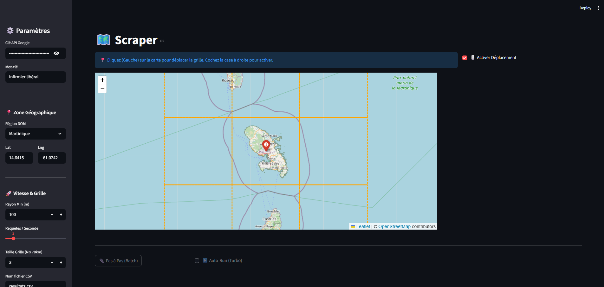

# 🗺️ DOM Scraper Live

A powerful **Google Places scraper** with a real-time interactive map interface, built with Streamlit and Folium. Designed specifically for scraping business data across French Overseas Territories (DOM-TOM).



## ✨ Features

- **🗺️ Interactive Map** – Click to position your search grid anywhere on the map
- **📍 Pre-configured DOM Zones** – Quick access to Martinique, Guadeloupe, La Réunion, Mayotte, Guyane, Saint-Barthélemy & Saint-Martin
- **🔄 Adaptive Grid System** – Automatically subdivides dense areas to capture all results
- **⚡ Parallel Processing** – Multi-threaded API calls with configurable RPS (requests per second)
- **📊 Live Progress** – Real-time visualization of processed zones and found places
- **💾 CSV Export** – Save results with full Google Places data (name, address, coordinates, ratings, etc.)

## 🚀 Quick Start

### 1. Clone the repository
```bash
git clone https://github.com/YOUR_USERNAME/dom-scraper-live.git
cd dom-scraper-live
```

### 2. Install dependencies
```bash
pip install -r requirements.txt
```

### 3. Configure your API key
Create a `.env` file:
```env
GOOGLE_KEY=your_google_places_api_key
```

### 4. Run the app
```bash
streamlit run main.py
```

## 📋 Usage

1. **Select a zone** – Choose a DOM region from the dropdown or click on the map
2. **Set parameters** – Configure keyword, grid size, and request speed
3. **Start scraping** – Use "Pas à Pas" for batch mode or enable "Auto-Run" for continuous scraping
4. **Export data** – Click "Sauvegarder" to export results to CSV

## ⚙️ Configuration

| Parameter | Description | Default |
|-----------|-------------|---------|
| **Mot-clé** | Search keyword | `infirmier libéral` |
| **Rayon Min** | Minimum search radius (m) | `100` |
| **Requêtes/Seconde** | API calls per batch | `2` |
| **Taille Grille** | Initial grid size (N × 70km blocks) | `3` |

## 📁 Project Structure

```
├── main.py          # Streamlit app & scraping logic
├── utils.py         # API calls, geometry helpers, CSV handling
├── .env             # API key configuration
├── requirements.txt # Python dependencies
└── README.md        # This file
```

## 🔧 How It Works

1. **Grid Generation** – Creates an N×N grid of 70km blocks centered on your selected location
2. **Smart Subdivision** – If a zone returns 20+ results, it splits into 4 sub-quadrants
3. **Dense Area Handling** – For small zones still hitting 20+ results, fetches up to 3 pages (60 results)
4. **Deduplication** – Results are deduplicated by `place_id` when saved

## 📊 Output Format

The CSV export includes:
- `name` – Business name
- `place_id` – Unique Google identifier
- `formatted_address` – Full address
- `geometry.location.lat/lng` – Coordinates
- `rating` – Average rating
- `user_ratings_total` – Number of reviews
- `types` – Business categories
- `source_sector_id` – Sector that found this result

## ⚠️ Important Notes

- **API Costs** – This tool makes Google Places API calls. Monitor your usage to avoid unexpected charges.
- **Rate Limiting** – Respect Google's quotas. The default 2 RPS is conservative.
- **For Educational/Research Use** – Ensure compliance with Google's Terms of Service.

## 🛠️ Requirements

- Python 3.8+
- Google Cloud account with Places API enabled
- Valid API key with billing configured

## 📄 License

MIT License – Feel free to use and modify for your projects.

---

Made with ❤️ using [Streamlit](https://streamlit.io/) & [Folium](https://python-visualization.github.io/folium/)
